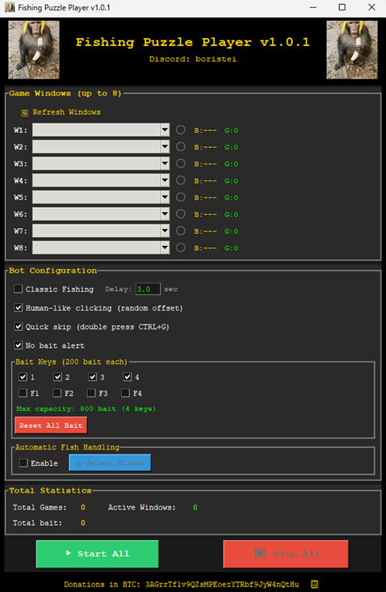

# MT2 Fishing Bot

Free fishing minigame bot for Metin2. No subscriptions, no licenses.

**Author:** boristei | **Discord:** boristei

---

## Preview

---

## Tutorial/Demo

**Watch the full tutorial:** [YouTube Video](https://www.youtube.com/watch?v=ZKCqTx8AKsU)

---

## Download

**Download:** [MediaFire](https://www.mediafire.com/file/mwhayph3ga5h5wx/Fishing_Puzzle_Player_v1.0.4.exe/file)

**VirusTotal:** [Scan Results](https://www.virustotal.com/gui/url/14393d15da07fe1873005ef3a6a5f25bdf12fa599fc6370e5c179ac7b7e63b68?nocache=1)

---

## Features

- Multi-window support (up to 8 clients, depends on hardware)
- Visual processing only (undetectable)
- Works on any server with the new or classic fishing system
- Configurable bait keys (1-4, F1-F4)
- Auto fish handling (keep/drop/open)
- Quick skip with horse (CTRL+G)
- F5 pause/resume

---

## How to Use

⚠️ **Execute the bot as administrator!** ⚠️

1. Execute the bot as administrator
2. Select target Metin2 windows
3. Enable/disable features and select bait hotkeys
   - ⚠️ Quick skip requires a horse!
   - ⚠️ Automatic fish handling requires inventory to be opened and as empty as possible!
4. Place bait within each selected hotkey
5. Start the bot!
6. Press **F5** to pause/resume

---

## Settings

- **Classic fishing minigame** - Enable for servers with the classic fishing system
- **Human-like clicking** - Random click offsets
- **Quick skip** - Auto-skip between games (requires horse)
- **Auto fish handling** - Configure keep/drop/open per fish type
  - ⚠️ Requires inventory to be open
  - Keep inventory as empty as possible
- **Show status log** - View bot activity

---

## Troubleshooting

**Q: Start button not showing?**
- Set Windows display scale to 100% (Settings → Display → Scale)

**Q: Bot is not opening fishes automatically?**
- Ensure inventory is opened and on the default position (right bottom corner)

---

## Planned Updates

- Jigsaw Puzzle solver

## TODO

- [ ] Implement item drop logic
- [ ] Auto fish handling across all inventory pages
- [ ] Fish skipping based on chat message (skip minigame)

---

## Donations :|

**BTC:** `3AGrrTf1v9QZsMPEoezYTRbf9JyW4nQtHu`

---

*For personal use only. Use at your own risk.*
