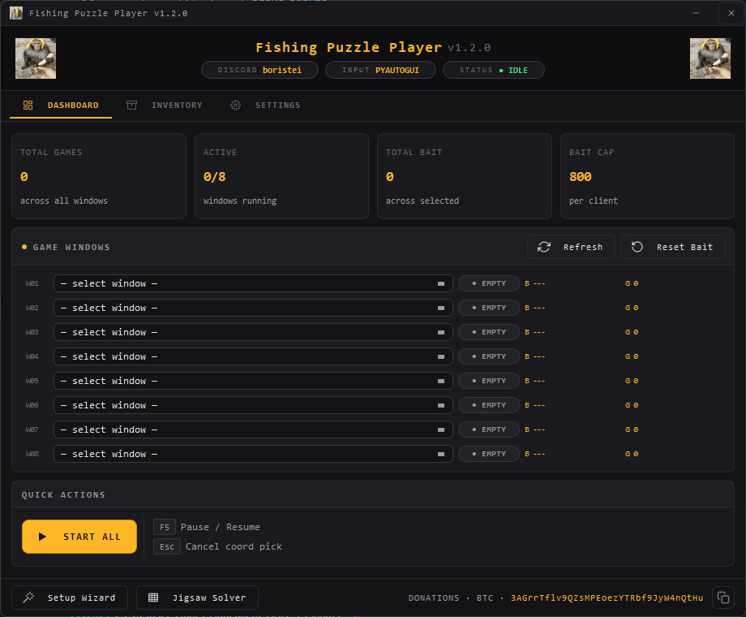

# MT2 Fishing Bot — v1.2
**THIS PROJECT WAS BUILT FOR EDUCATIONAL AND LEARNING PURPOSES ONLY!**

Free fishing minigame bot for Metin2. No subscriptions, no licenses.

**Author:** boristei | **Discord:** boristei

---

## Preview

---

## Tutorial/Demo

**Watch the full tutorial:** [YouTube Video](https://youtu.be/M0THxnio894)

---

## Download

**Latest Version:** 1.2 (2026)

---

## Features

- **Multi-window support** — Up to 8 simultaneous Metin2 clients
- **Visual processing only** — Completely undetectable
- **Dual fishing modes** — Both new minigame and classic fishing supported
- **Automatic inventory management** — Multi-page support (up to 8 pages) with auto-switching when full
- **Intelligent fish handling** — Keep/open/drop per fish type with automatic position detection
- **Integrated jigsaw solver** — Automatically solves the fishing jigsaw minigame
- **Quick skip modes** — Horse (CTRL+G) or armor slot equip/unequip
- **Configurable bait system** — Up to 4 bait hotkeys (1-4, F1-F4), 200 bait each
- **Advanced timing control** — Customizable click/key input delays for compatibility with different servers
- **GUI customization** — Accent color picker with RGB wave animation effects
- **F5 pause/resume** — Pause/resume all bots instantly

---

## How to Use

⚠️ **Execute the bot as administrator!** ⚠️

### Initial Setup

1. Execute the bot as administrator
2. Select target Metin2 windows (up to 8 clients)
3. **Configure inventory page tabs** (mandatory for page switching)
   - Click "Page 1" button and click the inventory page 1 tab in your game
   - Repeat for Pages 2, 3, and 4 (Pages 5-8 are optional)
   - This allows the bot to automatically switch pages when your inventory fills up
4. Configure auto fish handling (if enabled)
   - Click "Select Fishes & Items" to set keep/open/drop actions per fish
   - Set drop button and confirm button coordinates if using drop/sell/destroy
5. Enable/disable features and select bait hotkeys
   - ⚠️ Quick skip (Horse mode) requires a horse!
   - ⚠️ Quick skip (Armor mode) requires armor equipped and coordinates set!
   - ⚠️ Automatic fish handling requires inventory to be open!
6. Place bait in each selected hotkey slot
7. Start the bot!
8. Press **F5** to pause/resume all bots

(Optional) Enable the jigsaw solver
   - Toggle "Jigsaw Solver" in the GUI to automate the fishing jigsaw minigame
(Optional) Customize timing settings for your server
   - Click "⏱ Timing Settings..." to adjust click/key input delays
   - Default timings work for most servers; only adjust if needed

---

## Settings

### Core Fishing
- **Fishing Mode**
  - **Minigame mode** (default) — Detects the cyan fishing window and blue fish dot, clicks to catch
  - **Classic fishing mode** — Multi-scale template matching for single-image fish detection with fixed delay before reeling
    - Configurable delay (in seconds) after fish detection before pressing the reel-in key

### Inventory & Drop Management
- **Automatic Fish Handling** — Configure per-fish actions
  - **Keep** — Item stays in inventory (ignored in future catches)
  - **Open** — Double-click the item (for fish/sealed items)
  - **Drop/Sell** — Drag to drop button, then click confirm button
  - ⚠️ Requires inventory window to be open
  - Automatically switches to next inventory page when current page fills
- **Inventory Page Tabs** — Configure positions for up to 8 inventory pages
  - Pages 1-4 are **mandatory** (bot won't start without them)
  - Pages 5-8 are **optional** (only set if your game has extra pages)
  - Bot auto-switches pages when all slots on the current page are occupied

### Jigsaw Solver
- **Jigsaw Solver** — Automatically detects and solves the fishing jigsaw minigame
  - Toggle on/off from the main GUI
  - **Dry-run mode** — Simulates clicks without performing them (for testing)
  - **Crate priority** — Choose whether to fill normal or empty crates first
  - **Detection threshold** — Confidence level for piece recognition (default: 0.8)
  - **Action delay** — Delay between jigsaw clicks in seconds (default: 0.15)
  - Debug screenshots can be saved for troubleshooting

### Bait & Casting
- **Bait Management** — Configurable hotkeys (1-4 or F1-F4)
  - Each key = 200 bait (select 1-4 keys for 200-800 total bait)
  - Bait counter auto-decrements after each cast
  - Tier advances automatically when previous tier depletes
- **Quick Skip** — Auto-skip between games
  - **Horse mode** — Double press CTRL+G (dismount → remount)
  - **Armor mode** — Right-click configured armor slot (equip ↔ unequip)

### Input Timing
- **Timing Settings** ⏱
  - Fine-tune all click/key input delays for compatibility with different servers
  - Categories:
    - **Fish Clicking** — Cursor settle, mouse button hold, post-click settle
    - **Click Rhythm** — Min/max delay between attempts (human-like mode)
    - **Key Presses** — Key hold duration, pre-key window settle
    - **Bait & Cast** — Delay between bait and cast key
    - **Item Handling** — Waits after catches, opens, drops (game-response tunable)
    - **Quick Skip** — Gaps between armor equip/unequip operations
  - All values in milliseconds; defaults optimized for most servers
  - Click "⏱ Timing Settings..." to open the configuration window

### User Interface
- **Human-like Clicking** — Add randomized delays and position offsets to click operations
- **Accent Color** — Choose from multiple colors for the GUI theme
  - **RGB Wave Effect** (optional) — Animated rainbow color cycling
- **Display Options**
  - Show status log — Real-time activity messages (useful for debugging)
  - Debug mode (show ignored positions, fish detector overlay, inventory overlay, jigsaw overlay)

---

## Troubleshooting

**Q: Start button not showing?**
- Set Windows display scale to 100% (Settings → Display → Scale)
- The bot DPI-scales automatically, but 100% scale is preferred

**Q: Bot is not opening fishes/dropping items automatically?**
- Ensure inventory is open and visible
- Click the 📋 button to select which fish to keep/open/drop
- For drop actions, set drop button and confirm button coordinates
- Check that the timing settings are appropriate for your server (⏱ Timing Settings)

**Q: Jigsaw solver not detecting pieces?**
- Lower the detection threshold in jigsaw settings
- Ensure the jigsaw grid is fully visible on screen

**Q: Bot stops switching inventory pages?**
- Confirm all 4 mandatory page tabs are calibrated (Page 1–4 buttons)
- Ensure page tab coordinates match your current screen resolution

---

## Version History

- **v1.2.0 (Latest)** — Integrated jigsaw puzzle solver, jigsaw debug window and new GUI
- **v1.1.1** — New debug windows: inventory detection overlay, ignored positions grid
- **v1.1.0** — Multi-page inventory management, configurable timing settings, improved auto-drop stability
- **v1.0.5** — Redesigned GUI with better layout
- **v1.0.4** — Bug fixes for goldfish/zander detection, improved drop reliability
- **v1.0.3** — Fish drop mechanism implementation
- **v1.0.2** — Stability improvements
- **v1.0.1** — Classic fishing mode implementation
- **v1.0.0** — Initial release

---

## Known Limitations

- **Windows only** — Requires Windows 7 or newer
- **Administrator required** — Must run as admin for mouse/keyboard input injection
- **Game settings** — Display scale should be 100% for best detection (auto-scales but may need adjustment)
- **Inventory mode** — Auto fish handling works best when inventory is mostly empty at startup
- **Network latency** — If your server has high ping, increase item handling timing delays
- **Window positioning** — Game window must remain visible (can be in background but not minimized)

---

## Planned Updates

- [ ] Fish skipping based on chat messages (skip minigame when specific text appears)

---

## Donations :|

**BTC:** `3AGrrTf1v9QZsMPEoezYTRbf9JyW4nQtHu`

---

*For personal use only. Use at your own risk.*
